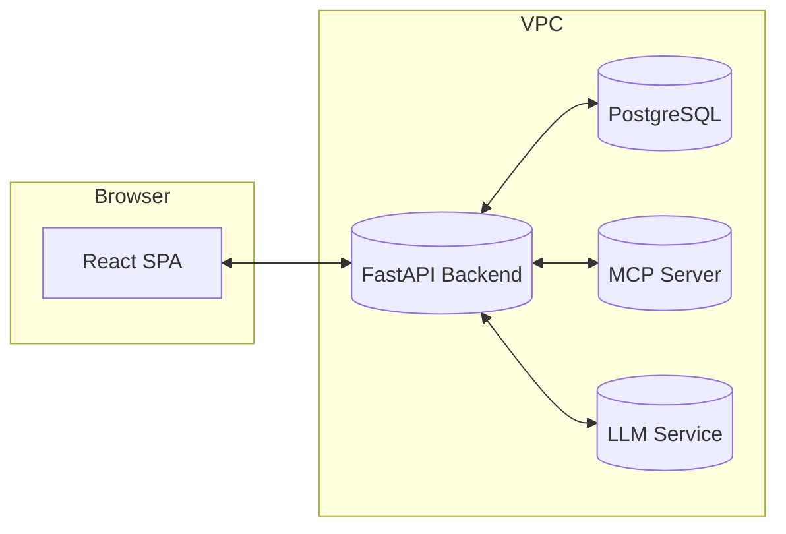

# Code Diagram

Lightweight repo to keep architecture and flow diagrams next to code.

## Live diagrams (rendered by GitHub)

### Architecture (Mermaid – C4-style)


### Tool-Cards Flow (Mermaid)
```mermaid
flowchart TD
  A[Load App] --> B[GET /catalog]
  B --> C{User picks tool card?}
  C -->|Formula 1| D[Render form (a,b)]
  D --> E[Submit]
  E --> F[POST tools/invoke]
  F --> G[Validate/Auth]
  G --> H{Adapter}
  H -->|Local| I[services.formula_1]
  H -->|MCP| J[MCP call formula_1]
  I --> K[Result]
  J --> K[Result]
  K --> L[Return to FE]
```

## Rendered images (optional)

If you render source files in `diagrams/` to images in `out/`, they’ll show here:

- **Infra (Graphviz)**  
  

- **Sequence (PlantUML)**  
  

## Local rendering (quick commands)

```powershell
# Graphviz (DOT -> PNG/SVG)
dot -Tpng .\diagrams\infra.dot -o .\out\infra.png
dot -Tsvg .\diagrams\infra.dot -o .\out\infra.svg

# PlantUML (via Docker; no Java needed)
docker run --rm -v "$PWD":/data plantuml/plantuml -tpng diagrams/sequence.puml
move diagrams\sequence.png out\sequence.png

# Mermaid (install once, then render)
npm i -g @mermaid-js/mermaid-cli
mmdc -i .\diagrams\flowchart.mmd -o .\out\flowchart.png
mmdc -i .\diagrams\sequence.mmd  -o .\out\sequence.png
```

## Repo layout

```
diagrams/  # sources (.mmd, .puml, .dot, .bpmn, .txt)
out/       # rendered images (.png/.svg)
README.md
```
