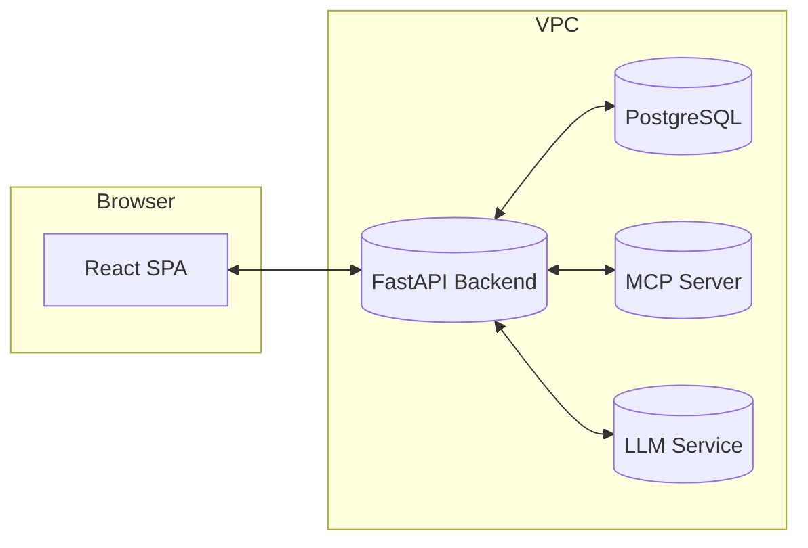
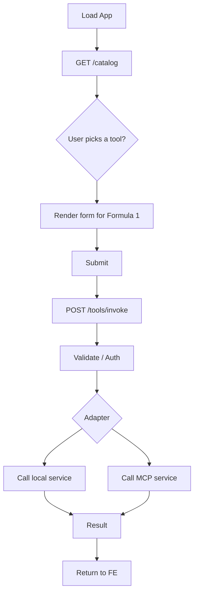

# Code Diagram

Lightweight repo to keep architecture and flow diagrams next to code.

## Live diagrams (rendered by GitHub)

### Architecture (Mermaid – C4-style)

```mermaid
flowchart LR
  subgraph Browser
    FE[React SPA]
  end
  subgraph VPC
    BE[(FastAPI Backend)]
    DB[(PostgreSQL)]
    MCP[(MCP Server)]
    LLM[(LLM Service)]
  end
  FE <--> BE
  BE <--> DB
  BE <--> MCP
  BE <--> LLM
```

### Tool-Cards Flow (Mermaid)

```mermaid
flowchart TD
  A[Load App] --> B[GET /catalog]
  B --> C{User picks a tool?}
  C --> D[Render form for Formula 1]
  D --> E[Submit]
  E --> F[POST /tools/invoke]
  F --> G[Validate / Auth]
  G --> H{Adapter}
  H --> I[Call local service]
  H --> J[Call MCP service]
  I --> K[Result]
  J --> K[Result]
  K --> L[Return to FE]
```
